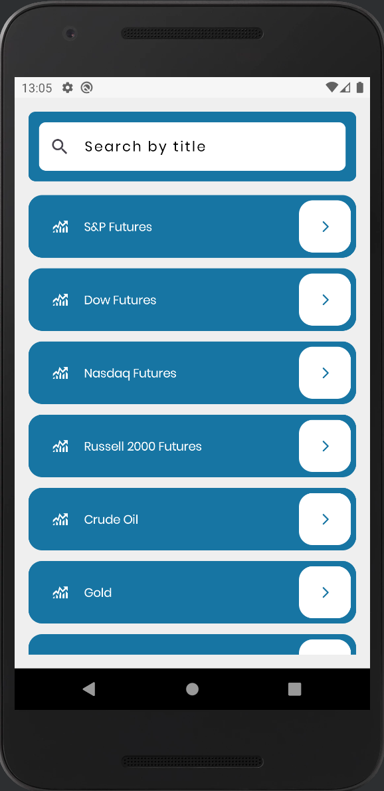
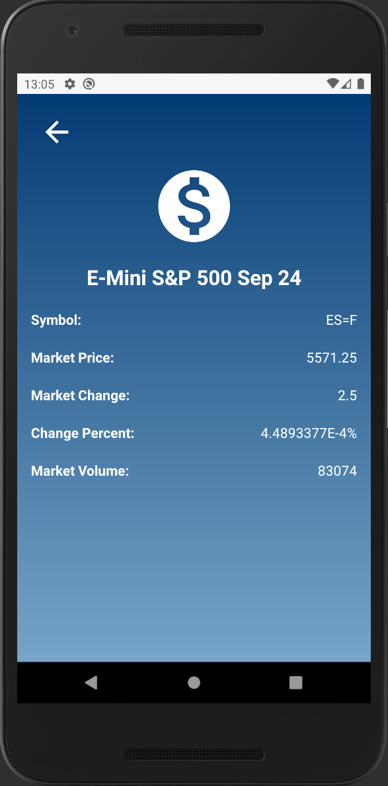
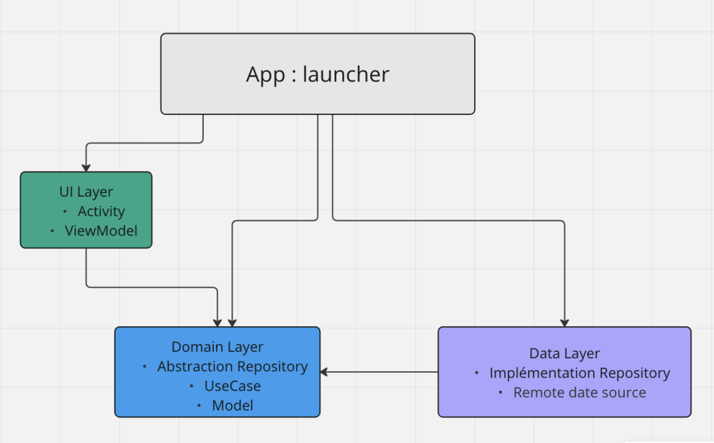

# StockApp

A small app for markets and stocks info.

Open source Api : https://rapidapi.com/apidojo/api/yh-finance

# Screenshots :

  
  

# Architecture & Technical choices

### Clean Architecture :

It reduces the dependencies of business logic on the services the app consumes (API, database, framework, third-party libraries), 
and ensures a stable application throughout its evolution, testing, and when external resources change or are updated.

### Coroutines Kotlin :
They provide an API that allows you to write asynchronous code. With Kotlin coroutines, you can define a CoroutineScope that helps you manage when your coroutines should run. 
Each asynchronous operation runs on a specific thread.

### Hilt :
Hilt is a dependency injection library for Android that reduces the boilerplate of manual dependency injection in your project. 
Manual dependency injection requires you to construct each class and its dependencies by hand, and use containers to reuse and manage the dependencies.

### Retrofit :
It is a secure HTTP client for Android. Retrofit simplifies connecting to a REST web service by translating the API into interfaces. 
It is powerful and facilitates the consumption of JSON or XML data, which is then parsed into objects. 
GET, POST, PUT, PATCH, and DELETE requests can all be executed. Retrofit uses #OkHttp (from the same developer) to handle network requests.
Additionally, Retrofit uses the #Gson converter to parse JSON objects.

### UI Compose
Create better apps faster with Jetpack Compose. Jetpack Compose is Android's modern toolkit for building native user interfaces. 
It simplifies and accelerates UI development on Android. Bring your app to life quickly with less code, powerful tools, and intuitive Kotlin APIs.

# Android, Architecture Components & jetpack

https://developer.android.com/jetpack/docs/guide

# Open Source Libraries

Kotlin      : https://kotlinlang.org

Gson        : https://github.com/google/gson

Retrofit    : https://square.github.io/retrofit

OkHttp      : https://square.github.io/okhttp

hilt        : https://dagger.dev/hilt/

Coroutines  : https://github.com/Kotlin/kotlinx.coroutines

Compose     : https://developer.android.com/jetpack/compose
